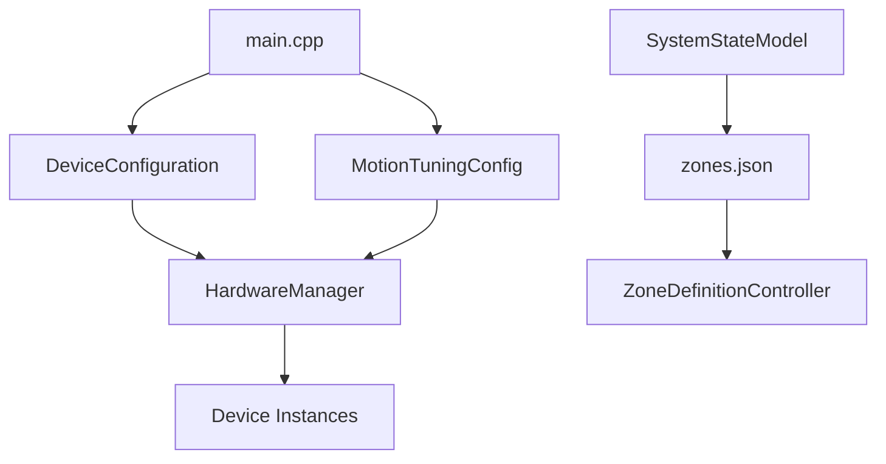

# JSON Configuration Management - Professional Architecture Analysis
## El 7aress RCWS - Remote Controlled Weapon Station

**Author:** System Architecture Analysis
**Date:** 2025-01-17
**Version:** 1.0
**Classification:** Military Grade Embedded System

---

## 1. EXECUTIVE SUMMARY

This document provides a comprehensive analysis of the JSON configuration management system in the El 7aress RCWS (Remote Controlled Weapon Station), a Qt6/QML-based military embedded application designed for the Tunisian Ministry of Defense.

### Key Findings:
- **3 JSON Configuration Files** are managed at build time via `resources.qrc`
- **2 Files** are loaded in `main.cpp` before system initialization
- **1 File** is loaded dynamically by `SystemStateModel` class
- Coordinate calculations follow **MIL-STD separation patterns** with proper ballistics compensation
- Current architecture has **tight coupling** between configuration loading and application startup

---

## 2. PROJECT ARCHITECTURE OVERVIEW

### 2.1 System Architecture Pattern

```
┌─────────────────────────────────────────────────────────────┐
│                    QML UI Layer (OsdOverlay.qml)            │
│  • Reticle Display (with zeroing/lead offsets)             │
│  • Tracker Box (visual target position)                     │
│  • CCIP Pipper (ballistic impact prediction)               │
└─────────────────────────────────────────────────────────────┘
                            ▼
┌─────────────────────────────────────────────────────────────┐
│              Controller Layer (MVVM Pattern)                │
│  • OsdController: Updates OSD ViewModel from SystemState   │
│  • WeaponController: Calculates ballistics & lead angles   │
└─────────────────────────────────────────────────────────────┘
                            ▼
┌─────────────────────────────────────────────────────────────┐
│         SystemStateModel (Central Data Aggregator)          │
│  • Single source of truth for all system data              │
│  • Aggregates data from ALL hardware devices               │
│  • Manages zone definitions (loaded from zones.json)       │
└─────────────────────────────────────────────────────────────┘
                            ▼
┌─────────────────────────────────────────────────────────────┐
│              Hardware Controllers (MIL-STD)                 │
│  • GimbalController, CameraController, etc.                │
│  Device Layer → Protocol Parser → Transport Layer           │
└─────────────────────────────────────────────────────────────┘
```

**Design Pattern:** Model-View-ViewModel (MVVM) with Observer Pattern (Qt Signals/Slots)

---

## 3. JSON FILES LOADED IN MAIN.CPP

### File Location: `src/main.cpp` (Lines 76-88)

### 3.1 Device Configuration: `devices.json`

**Load Location:** `main.cpp:76-80`
```cpp
QString devicesPath = configDir + "/devices.json";
if (!DeviceConfiguration::load(devicesPath)) {
    qCritical() << "Failed to load device configuration";
    return -1;  // FATAL ERROR - Application exits
}
```

**Purpose:** Hardware device connection parameters
- Serial port paths and baud rates
- Modbus RTU slave IDs and timeouts
- Camera device paths and control ports
- Performance buffer sizes
- Safety temperature thresholds

**Critical Dependencies:**
- **HardwareManager** uses this to create all device instances
- **Loaded BEFORE** any hardware initialization
- Application **CANNOT START** without this file

**Structure Example:**
```json
{
  "video": {
    "dayCamera": {
      "devicePath": "/dev/video0",
      "controlPort": "/dev/serial/by-id/..."
    }
  },
  "servo": {
    "azimuth": {
      "port": "/dev/serial/by-id/...",
      "baudRate": 230400,
      "slaveId": 2
    }
  },
  "safety": {
    "motorMaxTemp": 80.0,
    "requireArmedState": true
  }
}
```

---

### 3.2 Motion Tuning: `motion_tuning.json`

**Load Location:** `main.cpp:82-88`
```cpp
QString motionTuningPath = configDir + "/motion_tuning.json";
if (!MotionTuningConfig::load(motionTuningPath)) {
    qWarning() << "Failed to load motion tuning config";
    // CONTINUES ANYWAY - Uses default values
}
```

**Purpose:** Field-adjustable motion control parameters (PID gains, filters, acceleration limits)
- PID controller gains for tracking/scanning modes
- Low-pass filter cutoff frequencies
- Servo step-to-degree conversion factors
- Motion acceleration/velocity limits

**Non-Critical:** Application continues with defaults if file is missing

**Key Feature:** **Field-tunable without recompilation**

**Structure Example:**
```json
{
  "filters": {
    "gyro": { "cutoffFreqHz": 5.0 },
    "tracking": { "positionTau": 0.12 }
  },
  "pid": {
    "tracking": {
      "azimuth": { "kp": 1.0, "ki": 0.005, "kd": 0.01 }
    }
  },
  "servo": {
    "azStepsPerDegree": 618.0556
  }
}
```

---

## 4. JSON FILE LOADED BY SYSTEMSTATEMODEL

### 4.1 Zone Definitions: `zones.json`

**Load Location:** `SystemStateModel::loadZonesFromFile()` (called by ZoneDefinitionController)

**Purpose:** Operational zone definitions
- No-Fire Zones (where weapon discharge is prohibited)
- No-Traverse Zones (where gimbal cannot enter)
- Sector Scan Zones (automated scanning patterns)
- Target Reference Points (TRPs - preset aim points)

**Loading Mechanism:** **Dynamic** (loaded on-demand, saved on modification)

**Structure Example:**
```json
{
  "zoneFileVersion": 1,
  "areaZones": [
    {
      "id": 1,
      "type": 2,
      "isEnabled": false,
      "startAzimuth": 340,
      "endAzimuth": 30,
      "minElevation": -10,
      "maxElevation": 20,
      "name": ""
    }
  ],
  "sectorScanZones": [
    {
      "id": 1,
      "isEnabled": true,
      "az1": 350, "el1": 10,
      "az2": 350, "el2": 0,
      "scanSpeed": 20
    }
  ],
  "targetReferencePoints": [
    {
      "id": 1,
      "azimuth": 40,
      "elevation": 35,
      "haltTime": 5
    }
  ]
}
```

---

## 5. RESOURCES.QRC REGISTRATION

**File Location:** `resources/resources.qrc` (Lines 21-23)

```xml
<RCC>
    <qresource prefix="/">
        <file>../config/devices.json</file>
        <file>../config/motion_tuning.json</file>
        <file>../config/zones.json</file>
        <!-- ... other QML and resources ... -->
    </qresource>
</RCC>
```

**Build Integration:**
- Files are **compiled into the executable** as Qt resources
- Accessible via `qrc:/config/devices.json` notation
- Enables embedded deployment (no external file dependencies)

**Note:** Current `main.cpp` loads from filesystem paths, not from QRC resources. This is intentional for field configurability.

---

## 6. COORDINATE CALCULATION ARCHITECTURE

### 6.1 Reticle Position Calculation

**Class:** `ReticleAimpointCalculator`
**File:** `src/utils/reticleaimpointcalculator.h`

**Method:**
```cpp
QPointF calculateReticleImagePositionPx(
    float zeroingAzDeg, float zeroingElDeg, bool zeroingActive,
    float leadAzDeg, float leadElDeg, bool leadActive, LeadAngleStatus leadStatus,
    float cameraHfovDeg, int imageWidthPx, int imageHeightPx
);
```

**Calculation Flow:**
```
1. Start with screen center (reticle base position)
2. Apply ZEROING offset (gun-camera boresight correction)
   → Angular offset converted to pixel shift using FOV
3. Apply LEAD ANGLE offset (moving target compensation)
   → Only if leadActive && status != Off
4. Return final pixel position (x, y)
```

**QML Display:** `qml/components/OsdOverlay.qml` (Lines 647-660)
```qml
ReticleRenderer {
    id: reticle
    anchors.centerIn: parent
    anchors.horizontalCenterOffset: viewModel ? viewModel.reticleOffsetX : 0
    anchors.verticalCenterOffset: viewModel ? viewModel.reticleOffsetY : 0

    reticleType: viewModel ? viewModel.reticleType : 1
    color: accentColor
    currentFov: viewModel ? viewModel.currentFov : 45.0
}
```

---

### 6.2 Tracker Box Position Calculation

**Source:** `SystemStateModel::updateTrackingResult()`

**Data Flow:**
```
CameraVideoStreamDevice (VPI Tracking)
    ↓
frameDataReady(FrameData) signal
    ↓
SystemStateModel::updateTrackingResult()
    ↓
SystemStateData::tracking.boxCenterX_px (raw pixel position)
    ↓
OsdViewModel::trackingBox (QRectF for QML)
    ↓
OsdOverlay.qml TrackingBox component
```

**QML Display:** `qml/components/OsdOverlay.qml` (Lines 703-712)
```qml
TrackingBox {
    visible: viewModel ? viewModel.trackingBoxVisible : false
    x: viewModel ? viewModel.trackingBox.x : 0
    y: viewModel ? viewModel.trackingBox.y : 0
    width: viewModel ? viewModel.trackingBox.width : 0
    height: viewModel ? viewModel.trackingBox.height : 0

    boxColor: viewModel ? viewModel.trackingBoxColor : "yellow"
    dashed: viewModel ? viewModel.trackingBoxDashed : false
}
```

**Coordinate System:** **Absolute screen pixels** (from VPI tracker output)

---

### 6.3 CCIP Pipper Position Calculation

**Purpose:** Continuously Computed Impact Point (where bullets will hit with lead compensation)

**Calculation Class:** `BallisticsProcessor`

**Method:**
```cpp
LeadCalculationResult calculateLeadAngle(
    float targetRangeMeters,
    float targetAngularRateAzDegS,
    float targetAngularRateElDegS,
    float currentMuzzleVelocityMPS,
    float projectileTimeOfFlightGuessS,
    float currentCameraFovHorizontalDegrees,
    float currentCameraFovVerticalDegrees
);
```

**Result Structure:**
```cpp
struct LeadCalculationResult {
    float leadAzimuthDegrees;    // Lead offset in azimuth
    float leadElevationDegrees;  // Lead offset in elevation (includes bullet drop)
    LeadAngleStatus status;      // Off, On, Lag, ZoomOut
};
```

**CCIP Position = Screen Center + Lead Angle Offset (in pixels)**

**QML Display:** `qml/components/OsdOverlay.qml` (Lines 688-698)
```qml
CcipPipper {
    id: ccipPipper

    // Position using absolute screen coordinates from viewModel
    x: (viewModel ? viewModel.ccipX : (parent.width / 2)) - (width / 2)
    y: (viewModel ? viewModel.ccipY : (parent.height / 2)) - (height / 2)

    pipperEnabled: viewModel ? viewModel.ccipVisible : false
    status: viewModel ? viewModel.ccipStatus : "Off"
    accentColor: osdRoot.accentColor
}
```

**Visual Representation:** `qml/components/CcipPipper.qml`
- **Diamond shape** with center dot
- Color coding:
  - **Cyan:** Valid firing solution
  - **Yellow:** Computing/Lag (lead at limit)
  - **Red:** Zoom Out (FOV too narrow for lead angle)

---

### 6.4 Coordinate System Relationships

```
COORDINATE FLOW:

Physical World (Azimuth/Elevation angles)
    ↓
Gimbal Servos (Modbus steps)
    ↓
SystemStateModel (degrees + sensor data)
    ↓
BallisticsProcessor + ReticleAimpointCalculator
    ↓
Angular offsets (degrees) → Pixel offsets (FOV-based conversion)
    ↓
OsdViewModel (screen pixel coordinates)
    ↓
QML Display (OsdOverlay.qml)
```

**Key Conversion:**
```cpp
// From ReticleAimpointCalculator
pixelShiftX = (angularOffsetAz / cameraHfovDeg) * imageWidthPx;
pixelShiftY = -(angularOffsetEl / cameraVfovDeg) * imageHeightPx;  // Negative: screen Y is inverted
```

---

## 7. PROFESSIONAL CONFIGURATION MANAGEMENT APPROACH

### 7.1 Current Architecture Issues

**Problems Identified:**

1. **Tight Coupling:** Configuration loading is embedded in `main.cpp`
2. **Hard-Coded Paths:** Search paths are defined in startup code
3. **No Hot-Reload:** Configuration changes require application restart
4. **Mixed Patterns:** Some configs are critical (fatal error), others are optional
5. **Limited Validation:** Minimal runtime validation of configuration values
6. **No Version Control:** No config file format versioning (except zones.json)

---

### 7.2 Recommended Architecture: Configuration Manager Pattern

```cpp
┌─────────────────────────────────────────────────────────────┐
│                   ConfigurationManager                      │
│  (Singleton Pattern - Centralized Config Access)           │
├─────────────────────────────────────────────────────────────┤
│  Public Interface:                                          │
│  • static ConfigurationManager& instance()                  │
│  • bool loadAll(const QString& configDir)                   │
│  • bool reload(ConfigType type)                             │
│  • void watchForChanges()  // File system watcher           │
│  • ValidationResult validate(ConfigType type)               │
│                                                             │
│  Configuration Access:                                      │
│  • DeviceConfiguration& devices()                           │
│  • MotionTuningConfig& motionTuning()                       │
│  • ZoneConfiguration& zones()                               │
│                                                             │
│  Signals:                                                   │
│  • configChanged(ConfigType type)                           │
│  • configError(ConfigType type, QString error)              │
└─────────────────────────────────────────────────────────────┘
```

---

### 7.3 Proposed Implementation

#### **Phase 1: Configuration Manager Class**

**File:** `src/config/ConfigurationManager.h`

```cpp
#ifndef CONFIGURATIONMANAGER_H
#define CONFIGURATIONMANAGER_H

#include <QObject>
#include <QString>
#include <QFileSystemWatcher>
#include <memory>

// Forward declarations
class DeviceConfiguration;
class MotionTuningConfig;
class ZoneConfiguration;

enum class ConfigType {
    Devices,
    MotionTuning,
    Zones
};

struct ValidationResult {
    bool isValid;
    QStringList errors;
    QStringList warnings;
};

class ConfigurationManager : public QObject
{
    Q_OBJECT

public:
    // Singleton access
    static ConfigurationManager& instance();

    // Initialization
    bool loadAll(const QString& configDir);
    bool reload(ConfigType type);

    // Access to configuration objects
    DeviceConfiguration& devices();
    MotionTuningConfig& motionTuning();
    ZoneConfiguration& zones();

    // Validation
    ValidationResult validate(ConfigType type);
    ValidationResult validateAll();

    // Hot-reload support
    void enableFileWatcher(bool enable);

signals:
    void configChanged(ConfigType type);
    void configError(ConfigType type, QString error);

private:
    ConfigurationManager();
    ~ConfigurationManager();

    // Prevent copying
    ConfigurationManager(const ConfigurationManager&) = delete;
    ConfigurationManager& operator=(const ConfigurationManager&) = delete;

    // Private members
    std::unique_ptr<DeviceConfiguration> m_devices;
    std::unique_ptr<MotionTuningConfig> m_motionTuning;
    std::unique_ptr<ZoneConfiguration> m_zones;

    QFileSystemWatcher* m_fileWatcher;
    QString m_configDir;

    // Private methods
    bool loadDevices();
    bool loadMotionTuning();
    bool loadZones();
};

#endif // CONFIGURATIONMANAGER_H
```

---

#### **Phase 2: Structured Configuration Classes**

**DeviceConfiguration Refactor:**
```cpp
class DeviceConfiguration {
public:
    struct ServoConfig {
        QString port;
        int baudRate;
        int slaveId;
        int timeoutMs;
        int retries;

        bool isValid() const;
    };

    struct CameraConfig {
        QString devicePath;
        QString controlPort;
        int width;
        int height;
        int framerate;

        bool isValid() const;
    };

    // Accessor methods
    const ServoConfig& azimuthServo() const;
    const ServoConfig& elevationServo() const;
    const CameraConfig& dayCamera() const;
    const CameraConfig& nightCamera() const;

    // Validation
    ValidationResult validate() const;

private:
    ServoConfig m_azServo;
    ServoConfig m_elServo;
    CameraConfig m_dayCamera;
    CameraConfig m_nightCamera;
    // ... other configurations
};
```

---

#### **Phase 3: Modified main.cpp**

```cpp
int main(int argc, char *argv[])
{
    QGuiApplication app(argc, argv);
    gst_init(&argc, &argv);

    // Initialize configuration manager
    ConfigurationManager& config = ConfigurationManager::instance();

    // Load all configurations
    QString configDir = findConfigDirectory();  // Helper function
    if (!config.loadAll(configDir)) {
        qCritical() << "Failed to load configurations!";
        return -1;
    }

    // Validate configurations
    ValidationResult validation = config.validateAll();
    if (!validation.isValid) {
        qCritical() << "Configuration validation failed:";
        for (const QString& error : validation.errors) {
            qCritical() << "  ERROR:" << error;
        }
        return -1;
    }

    // Show warnings but continue
    for (const QString& warning : validation.warnings) {
        qWarning() << "  WARNING:" << warning;
    }

    // Initialize system with validated configs
    SystemController sysCtrl;
    sysCtrl.initializeHardware();

    QQmlApplicationEngine engine;
    sysCtrl.initializeQmlSystem(&engine);

    engine.load(QUrl(QStringLiteral("qrc:/qml/views/main.qml")));

    // Enable hot-reload for development builds
    #ifdef QT_DEBUG
    config.enableFileWatcher(true);
    #endif

    sysCtrl.startSystem();

    return app.exec();
}
```

---

### 7.4 Configuration Loading Strategies

#### **Strategy 1: Embedded Resources (Production)**
```cpp
// For production deployment (embedded in executable)
QFile file(":/config/devices.json");
if (file.open(QIODevice::ReadOnly)) {
    QJsonDocument doc = QJsonDocument::fromJson(file.readAll());
    // Parse and load...
}
```

**Pros:**
- Self-contained executable
- No external file dependencies
- Protected from tampering

**Cons:**
- Requires recompilation for changes
- Larger executable size

---

#### **Strategy 2: Filesystem with Fallback (Hybrid)**
```cpp
bool loadConfiguration(const QString& filename) {
    // Try filesystem first (for field updates)
    QFile fsFile("/etc/rcws/config/" + filename);
    if (fsFile.exists() && fsFile.open(QIODevice::ReadOnly)) {
        return parseConfig(fsFile.readAll());
    }

    // Fallback to embedded resource
    QFile resFile(":/config/" + filename);
    if (resFile.open(QIODevice::ReadOnly)) {
        qWarning() << "Using embedded default config for" << filename;
        return parseConfig(resFile.readAll());
    }

    qCritical() << "Config file not found:" << filename;
    return false;
}
```

**Pros:**
- Field-updateable without rebuild
- Safe fallback to defaults
- Best of both worlds

**Cons:**
- Slightly more complex logic

---

#### **Strategy 3: Layered Configuration (Advanced)**
```cpp
class LayeredConfiguration {
public:
    void addLayer(const QString& filepath, int priority);
    // Lower priority = override higher priority

    QVariant getValue(const QString& key) const {
        // Search from lowest to highest priority
        for (const auto& layer : m_layers) {
            if (layer.contains(key)) {
                return layer.value(key);
            }
        }
        return QVariant();  // Not found
    }

private:
    struct ConfigLayer {
        QJsonObject data;
        int priority;
        QString source;
    };

    QVector<ConfigLayer> m_layers;  // Sorted by priority
};
```

**Example Usage:**
```cpp
LayeredConfiguration config;
config.addLayer(":/config/devices.json", 100);       // Embedded defaults
config.addLayer("/etc/rcws/devices.json", 50);       // System-wide overrides
config.addLayer("~/.rcws/devices.json", 10);         // User-specific overrides
config.addLayer("/tmp/rcws_test.json", 1);           // Test overrides

QString port = config.getValue("servo.azimuth.port").toString();
```

**Pros:**
- Maximum flexibility
- Development/test overrides without modifying production files
- Clear configuration inheritance

**Cons:**
- Complex implementation
- Potential confusion about which value is active

---

### 7.5 Hot-Reload Implementation

```cpp
void ConfigurationManager::enableFileWatcher(bool enable)
{
    if (enable && !m_fileWatcher) {
        m_fileWatcher = new QFileSystemWatcher(this);

        // Watch all config files
        m_fileWatcher->addPath(m_configDir + "/devices.json");
        m_fileWatcher->addPath(m_configDir + "/motion_tuning.json");
        m_fileWatcher->addPath(m_configDir + "/zones.json");

        connect(m_fileWatcher, &QFileSystemWatcher::fileChanged,
                this, &ConfigurationManager::onFileChanged);
    } else if (!enable && m_fileWatcher) {
        delete m_fileWatcher;
        m_fileWatcher = nullptr;
    }
}

void ConfigurationManager::onFileChanged(const QString& path)
{
    qInfo() << "Configuration file changed:" << path;

    // Determine which config changed
    ConfigType type;
    if (path.contains("devices.json")) {
        type = ConfigType::Devices;
    } else if (path.contains("motion_tuning.json")) {
        type = ConfigType::MotionTuning;
    } else if (path.contains("zones.json")) {
        type = ConfigType::Zones;
    } else {
        return;  // Unknown file
    }

    // Reload with validation
    if (reload(type)) {
        emit configChanged(type);
        qInfo() << "Configuration reloaded successfully";
    } else {
        emit configError(type, "Failed to reload configuration");
    }
}
```

**Use Case:**
- Developer changes PID gains in `motion_tuning.json`
- File watcher detects change
- System reloads config automatically
- Motion controllers pick up new gains
- **No application restart required**

---

### 7.6 Configuration Validation Framework

```cpp
class ConfigValidator {
public:
    static ValidationResult validateDeviceConfig(const DeviceConfiguration& config) {
        ValidationResult result;
        result.isValid = true;

        // Validate serial ports exist
        if (!QFile::exists(config.azimuthServo().port)) {
            result.errors << "Azimuth servo port does not exist: " + config.azimuthServo().port;
            result.isValid = false;
        }

        // Validate baud rates are standard
        QList<int> validBaudRates = {9600, 19200, 38400, 57600, 115200, 230400};
        if (!validBaudRates.contains(config.azimuthServo().baudRate)) {
            result.warnings << "Non-standard baud rate for azimuth servo: " +
                              QString::number(config.azimuthServo().baudRate);
        }

        // Validate camera resolution
        if (config.dayCamera().width % 16 != 0) {
            result.warnings << "Camera width should be multiple of 16 for optimal performance";
        }

        // Validate safety parameters
        if (config.safety().motorMaxTemp > 90.0f) {
            result.errors << "Motor max temperature exceeds safe limit (90°C)";
            result.isValid = false;
        }

        return result;
    }

    static ValidationResult validateMotionTuning(const MotionTuningConfig& config) {
        ValidationResult result;
        result.isValid = true;

        // Validate PID gains are positive
        if (config.trackingPID().azimuth.kp <= 0.0f) {
            result.errors << "Tracking PID Kp must be positive";
            result.isValid = false;
        }

        // Validate filter frequencies are reasonable
        if (config.filters().gyroCutoffHz < 1.0f || config.filters().gyroCutoffHz > 50.0f) {
            result.warnings << "Gyro filter cutoff frequency outside recommended range (1-50 Hz)";
        }

        return result;
    }
};
```

---

### 7.7 Migration Path (Phased Approach)

#### **Phase 1: Refactor Existing Code (Low Risk)**
- Extract configuration loading logic into `ConfigurationManager`
- Keep existing behavior exactly the same
- Add comprehensive validation
- **No functional changes, just code organization**

**Estimated Effort:** 2-3 days

---

#### **Phase 2: Add Hot-Reload for Non-Critical Configs (Medium Risk)**
- Implement file watcher for `motion_tuning.json`
- Add reload capability for motion parameters
- **Devices config remains static (requires restart)**

**Estimated Effort:** 2-3 days

---

#### **Phase 3: Implement Layered Configuration (Advanced)**
- Add support for configuration overrides
- Implement test configuration layer
- Enable per-user configuration customization

**Estimated Effort:** 5-7 days

---

## 8. BEST PRACTICES & RECOMMENDATIONS

### 8.1 Configuration File Naming Convention
```
config/
  ├── devices.json           # Hardware connections
  ├── motion_tuning.json     # Motion control parameters
  ├── zones.json             # Operational zones
  ├── ballistics.json        # Ballistic tables (future)
  └── defaults/              # Factory defaults (read-only)
      ├── devices.default.json
      ├── motion_tuning.default.json
      └── zones.default.json
```

---

### 8.2 JSON Schema Validation

**Add JSON schemas for compile-time validation:**

```json
// devices.schema.json
{
  "$schema": "http://json-schema.org/draft-07/schema#",
  "type": "object",
  "required": ["version", "video", "servo", "safety"],
  "properties": {
    "version": {
      "type": "string",
      "pattern": "^[0-9]+\\.[0-9]+$"
    },
    "servo": {
      "type": "object",
      "properties": {
        "azimuth": {
          "type": "object",
          "required": ["port", "baudRate", "slaveId"],
          "properties": {
            "port": { "type": "string" },
            "baudRate": { "type": "integer", "enum": [9600, 19200, 38400, 57600, 115200, 230400] },
            "slaveId": { "type": "integer", "minimum": 1, "maximum": 247 }
          }
        }
      }
    }
  }
}
```

---

### 8.3 Configuration Backup & Versioning

```cpp
class ConfigurationBackup {
public:
    // Create timestamped backup
    static bool backup(const QString& configFile) {
        QString timestamp = QDateTime::currentDateTime().toString("yyyyMMdd_HHmmss");
        QString backupPath = configFile + ".backup." + timestamp;
        return QFile::copy(configFile, backupPath);
    }

    // Restore from backup
    static bool restore(const QString& configFile, const QString& backupFile) {
        // Validate backup file first
        if (!ConfigurationValidator::validate(backupFile)) {
            return false;
        }
        return QFile::copy(backupFile, configFile);
    }

    // Auto-cleanup old backups (keep last 10)
    static void cleanupOldBackups(const QString& configDir, int keepCount = 10) {
        QDir dir(configDir);
        QStringList backups = dir.entryList(QStringList() << "*.backup.*", QDir::Files, QDir::Time);

        // Remove old backups beyond keepCount
        for (int i = keepCount; i < backups.size(); ++i) {
            QFile::remove(dir.filePath(backups[i]));
        }
    }
};
```

---

### 8.4 Security Considerations

#### **File Permissions (Linux Deployment)**
```bash
# Configuration files should be readable by application
chmod 0640 /etc/rcws/config/*.json
chown root:rcws /etc/rcws/config/*.json

# Executable should run as dedicated user
useradd -r -s /bin/false rcws
```

#### **Integrity Checking (Optional)**
```cpp
class ConfigIntegrityChecker {
public:
    // Generate SHA-256 hash of config file
    static QString calculateHash(const QString& filepath) {
        QFile file(filepath);
        if (!file.open(QIODevice::ReadOnly)) return QString();

        QCryptographicHash hash(QCryptographicHash::Sha256);
        hash.addData(&file);
        return hash.result().toHex();
    }

    // Verify against known hash
    static bool verify(const QString& filepath, const QString& expectedHash) {
        return calculateHash(filepath) == expectedHash;
    }
};
```

---

## 9. COORDINATE CALCULATION USE CASES

### 9.1 Scenario: Moving Target Engagement

```
INITIAL STATE:
• Operator identifies moving vehicle at 800m
• Tracking system locks onto target
• Target moving at 30 km/h (8.33 m/s) perpendicular to LOS

COORDINATE CALCULATIONS:

Step 1: Tracker Position (Visual)
  VPI Tracker → centerX_px=650, centerY_px=400
  Display: Yellow box at (650, 400)

Step 2: Reticle Position (Base Aimpoint)
  Screen center: (640, 360)
  Zeroing offset: +2° Az, -0.5° El
  Converted to pixels: +35px X, -12px Y
  Display: Reticle at (675, 348)

Step 3: CCIP Position (Impact Prediction)
  BallisticsProcessor calculates:
    • Bullet TOF: 1.2 seconds
    • Target angular rate: 0.8°/s
    • Lead angle required: +1.0° Az, -0.3° El (drop)
  Converted to pixels: +17px X, -7px Y
  Final CCIP: (675 + 17, 348 - 7) = (692, 341)
  Display: Cyan diamond at (692, 341)

OPERATOR ACTION:
• Observes CCIP pipper overlaying target (accounting for lead)
• Fires weapon when CCIP is on target
• Bullet impacts target despite its motion
```

---

### 9.2 Scenario: Zeroing Procedure

```
INITIAL STATE:
• New weapon installed
• Boresight not aligned with camera LOS
• 100m target for zeroing

ZEROING WORKFLOW:

Step 1: Fire Test Shot
  • Reticle at screen center (640, 360)
  • Bullet impacts 20cm left, 10cm low of aim point

Step 2: Measure Impact Offset
  • 20cm at 100m = 0.2m / 100m = 0.002 radians = 0.115°
  • 10cm at 100m = 0.1m / 100m = 0.001 radians = 0.057°

Step 3: Enter Zeroing Mode
  • Operator uses joystick to move reticle to impact point
  • ZeroingController records offset: -0.115° Az, -0.057° El

Step 4: Apply Correction
  • SystemStateModel stores: zeroingOffsetAz = +0.115° (inverse)
  • ReticleAimpointCalculator shifts reticle RIGHT and UP
  • New reticle position: (640 + 20px, 360 + 10px) = (660, 370)

Step 5: Verify
  • Fire second shot
  • Bullet now impacts at reticle position
  • Zeroing complete, save to persistent storage
```

---

### 9.3 Scenario: Lead Angle Compensation (LAC)

```
INITIAL STATE:
• Tracking locked on fast-moving target
• Target at 1200m, moving 15°/s angular rate
• LAC enabled

CALCULATION FLOW:

Input Data (from SystemStateModel):
  • rangeMeters = 1200.0
  • targetAngularRateAzDegS = 15.0
  • targetAngularRateElDegS = 0.5
  • muzzleVelocityMPS = 850.0
  • currentFovHorizontal = 8.5°

BallisticsProcessor::calculateLeadAngle():
  1. Estimate bullet TOF:
     TOF ≈ range / muzzleVelocity = 1200 / 850 = 1.41 seconds

  2. Calculate lead required:
     leadAz = targetAngularRate * TOF = 15.0 * 1.41 = 21.15°
     leadEl = 0.5 * 1.41 + bulletDrop(1200m) = 0.7 + 2.3 = 3.0°

  3. Check FOV limits:
     Max displayable offset = FOV / 2 = 8.5 / 2 = 4.25°
     21.15° > 4.25° → STATUS = ZOOM_OUT

  4. Return result:
     status = LeadAngleStatus::ZoomOut
     leadAzimuth = 4.25° (clamped to displayable range)
     leadElevation = 3.0°

OsdController updates OsdViewModel:
  • ccipVisible = true
  • ccipStatus = "ZoomOut"
  • ccipX = centerX + clampedLeadPixels
  • ccipY = centerY + leadElPixels

QML Display:
  • Red diamond displayed at calculated position
  • "ZOOM OUT" text shown below pipper
  • Pulsing animation active
```

---

## 10. CONCLUSION

### 10.1 Summary of JSON Configuration Architecture

The El 7aress RCWS employs a **three-tier configuration system**:

1. **Critical Hardware Configuration** (`devices.json`)
   - Loaded at startup via `main.cpp`
   - Application-fatal if missing or invalid
   - Defines all hardware connection parameters

2. **Field-Tunable Parameters** (`motion_tuning.json`)
   - Loaded at startup via `main.cpp`
   - Non-critical (defaults used if missing)
   - Enables operator tuning without recompilation

3. **Dynamic Operational Data** (`zones.json`)
   - Loaded on-demand by `SystemStateModel`
   - Saved/modified during operation
   - Mission-specific zone definitions

### 10.2 Coordinate System Summary

**Three Independent Positioning Systems:**

1. **Reticle Position:** Base aimpoint + zeroing + lead angle offsets
2. **Tracker Box Position:** Real-time visual target tracking (VPI)
3. **CCIP Pipper Position:** Ballistic impact prediction with lead compensation

**Key Architectural Principle:**
```
Reticle ≠ Tracker ≠ CCIP
(Aim Point) (Visual Target) (Predicted Impact)
```

### 10.3 Recommendations Priority

**HIGH PRIORITY:**
1. Implement `ConfigurationManager` singleton pattern
2. Add comprehensive configuration validation
3. Create configuration backup mechanism

**MEDIUM PRIORITY:**
4. Add hot-reload support for `motion_tuning.json`
5. Implement JSON schema validation
6. Add configuration file versioning

**LOW PRIORITY:**
7. Implement layered configuration system
8. Add integrity checking (hashing)
9. Develop GUI configuration editor

---

## 11. APPENDIX

### 11.1 Configuration File Dependencies



### 11.2 Coordinate Calculation Dependency Graph

```
SystemStateModel (Central Data Hub)
    ├── Gimbal Position (Az/El angles)
    ├── Tracking Data (VPI pixel positions)
    ├── LRF Range (meters)
    ├── Camera FOV (degrees)
    └── Ballistic Parameters (zeroing/windage/lead)
         ↓
    BallisticsProcessor + ReticleAimpointCalculator
         ↓
    OsdViewModel (Screen Pixel Coordinates)
         ↓
    QML Display (OsdOverlay.qml)
```

### 11.3 Related Documentation

- `readme.md` - Project overview and build instructions
- `documentation/HARDWARE_ARCHITECTURE.md` - MIL-STD device layer architecture
- `CCIP.md` - CCIP implementation details
- `DIAGNOSTIC_REPORT.md` - System diagnostic procedures

---

**END OF DOCUMENT**

*This document provides a complete architectural analysis of JSON configuration management and coordinate calculation systems in the El 7aress RCWS. For implementation questions, consult the lead developer or system architecture team.*
